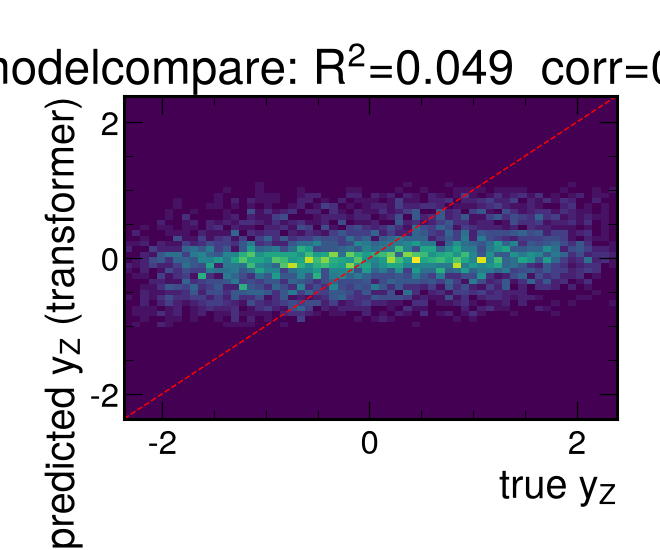
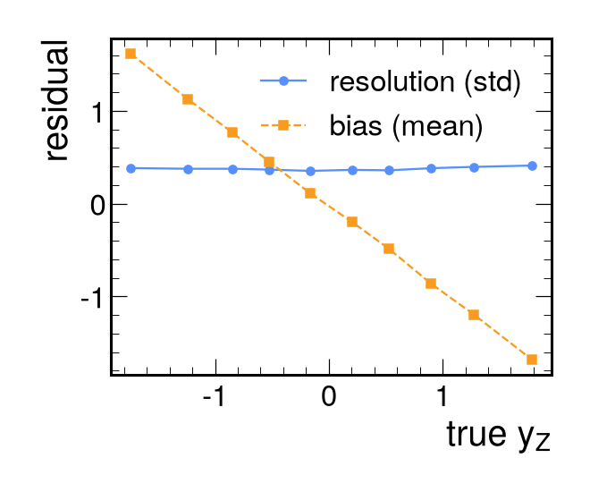

# Results (modelcompare)

- train events: 10500, test events: 2250
- targets: y_Z, pz_Z, beta_z

## Primary target: y_Z

| model | R2 | corr | RMSE | resolution | sign acc |
|---|---|---|---|---|---|
| mean | -0.000 | nan | 1.098 | 1.098 | 0.515 |
| linear | 0.028 | 0.167 | 1.082 | 1.082 | 0.560 |
| gbdt_summary | 0.017 | 0.153 | 1.088 | 1.088 | 0.555 |
| efn | 0.052 | 0.233 | 1.069 | 1.069 | 0.587 |
| transformer | 0.058 | 0.246 | 1.065 | 1.065 | 0.603 |

## pz_Z
| model | R2 | corr | RMSE |
|---|---|---|---|
| mean | -0.000 | nan | 159.384 |
| linear | 0.027 | 0.165 | 157.225 |
| gbdt_summary | 0.011 | 0.143 | 158.456 |
| efn | 0.057 | 0.239 | 154.784 |
| transformer | 0.059 | 0.243 | 154.623 |

## beta_z
| model | R2 | corr | RMSE |
|---|---|---|---|
| mean | -0.000 | nan | 0.693 |
| linear | 0.027 | 0.165 | 0.683 |
| gbdt_summary | 0.016 | 0.151 | 0.687 |
| efn | 0.046 | 0.234 | 0.676 |
| transformer | 0.053 | 0.248 | 0.674 |

