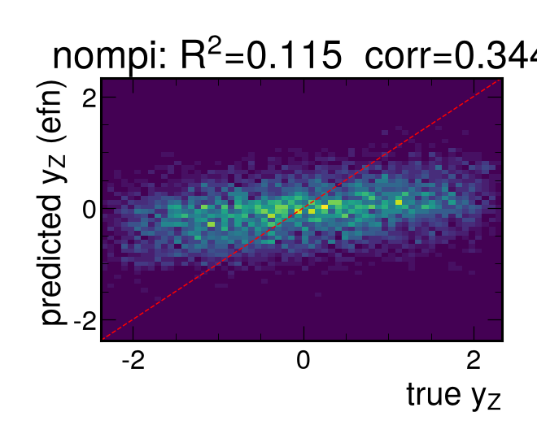
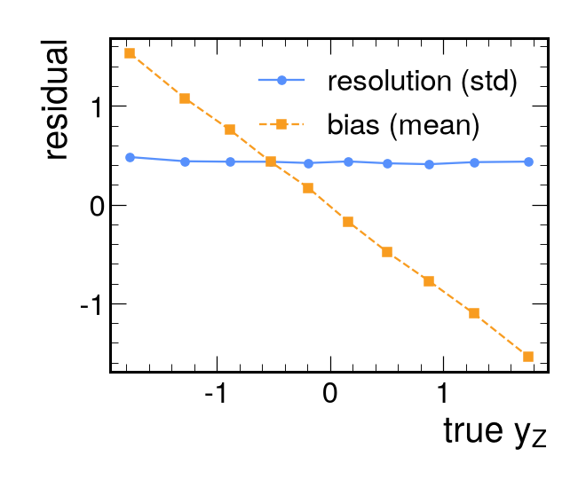

# Results (nompi)

- train events: 26804, test events: 5744
- targets: y_Z, pz_Z, beta_z

## Primary target: y_Z

| model | R2 | corr | RMSE | resolution | sign acc |
|---|---|---|---|---|---|
| mean | -0.000 | nan | 1.100 | 1.100 | 0.496 |
| linear | 0.068 | 0.261 | 1.062 | 1.062 | 0.593 |
| gbdt_summary | 0.081 | 0.285 | 1.054 | 1.054 | 0.592 |
| efn | 0.122 | 0.353 | 1.031 | 1.031 | 0.610 |

## pz_Z
| model | R2 | corr | RMSE |
|---|---|---|---|
| mean | -0.000 | nan | 162.701 |
| linear | 0.066 | 0.257 | 157.217 |
| gbdt_summary | 0.077 | 0.280 | 156.254 |
| efn | 0.131 | 0.362 | 151.665 |

## beta_z
| model | R2 | corr | RMSE |
|---|---|---|---|
| mean | -0.000 | nan | 0.691 |
| linear | 0.064 | 0.253 | 0.669 |
| gbdt_summary | 0.076 | 0.277 | 0.664 |
| efn | 0.105 | 0.341 | 0.654 |

