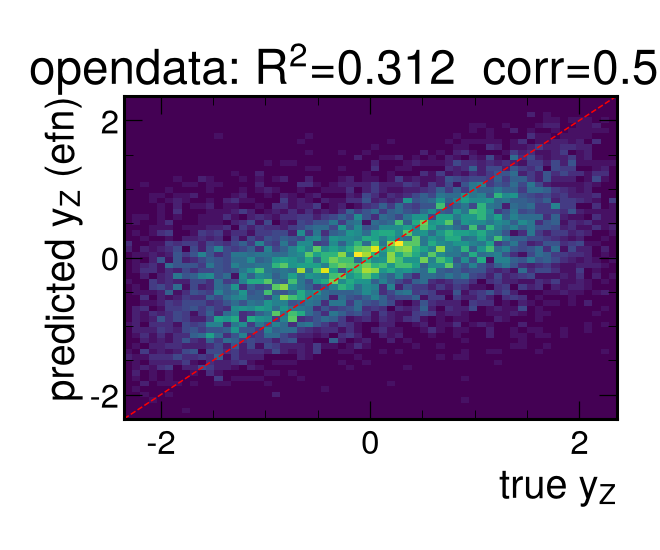
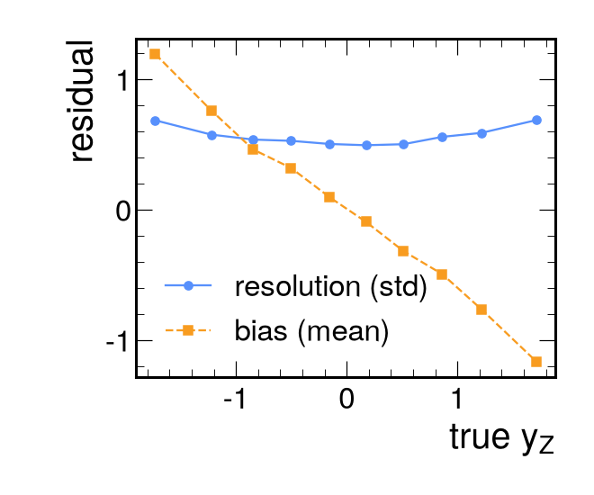

# Results (opendata)

- train events: 44178, test events: 9467
- targets: y_Z, pz_Z, beta_z

## Primary target: y_Z

| model | R2 | corr | RMSE | resolution | sign acc |
|---|---|---|---|---|---|
| mean | -0.000 | nan | 1.068 | 1.068 | 0.500 |
| linear | 0.001 | 0.033 | 1.067 | 1.067 | 0.513 |
| gbdt_summary | -0.005 | 0.009 | 1.070 | 1.070 | 0.505 |
| efn | 0.312 | 0.563 | 0.886 | 0.886 | 0.711 |

## pz_Z
| model | R2 | corr | RMSE |
|---|---|---|---|
| mean | -0.000 | nan | 155.575 |
| linear | 0.001 | 0.033 | 155.506 |
| gbdt_summary | -0.006 | 0.016 | 156.003 |
| efn | 0.287 | 0.538 | 131.343 |

## beta_z
| model | R2 | corr | RMSE |
|---|---|---|---|
| mean | -0.000 | nan | 0.680 |
| linear | 0.001 | 0.033 | 0.680 |
| gbdt_summary | -0.004 | 0.010 | 0.682 |
| efn | 0.313 | 0.566 | 0.564 |

