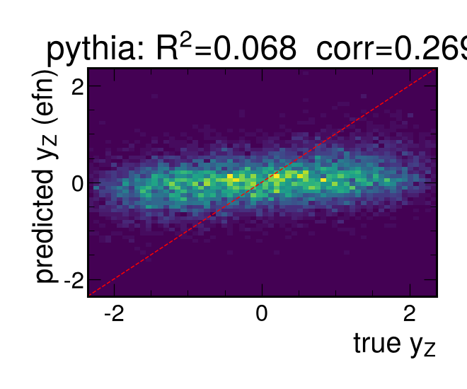
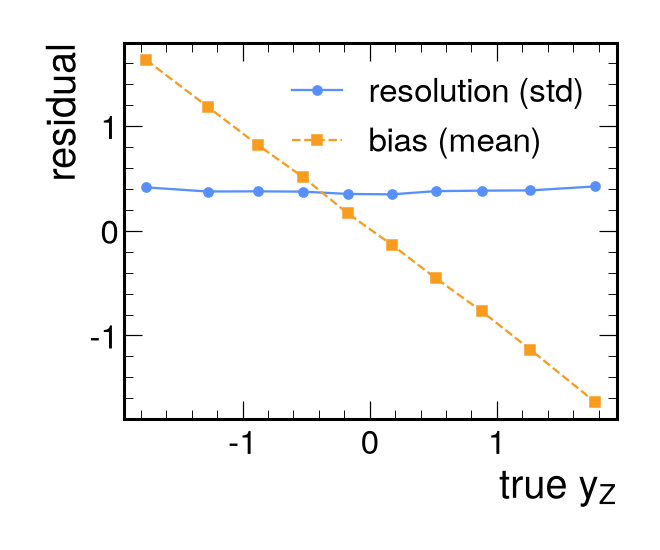

# Results (pythia)

- train events: 53256, test events: 11412
- targets: y_Z, pz_Z, beta_z

## Primary target: y_Z

| model | R2 | corr | RMSE | resolution | sign acc |
|---|---|---|---|---|---|
| mean | -0.000 | nan | 1.099 | 1.099 | 0.489 |
| linear | 0.028 | 0.169 | 1.083 | 1.083 | 0.564 |
| gbdt_summary | 0.031 | 0.178 | 1.082 | 1.081 | 0.562 |
| efn | 0.067 | 0.261 | 1.061 | 1.061 | 0.592 |

## pz_Z
| model | R2 | corr | RMSE |
|---|---|---|---|
| mean | -0.000 | nan | 163.344 |
| linear | 0.028 | 0.168 | 161.032 |
| gbdt_summary | 0.030 | 0.176 | 160.840 |
| efn | 0.072 | 0.270 | 157.368 |

## beta_z
| model | R2 | corr | RMSE |
|---|---|---|---|
| mean | -0.000 | nan | 0.691 |
| linear | 0.028 | 0.168 | 0.681 |
| gbdt_summary | 0.030 | 0.175 | 0.680 |
| efn | 0.062 | 0.258 | 0.669 |

