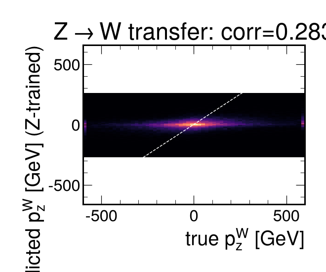
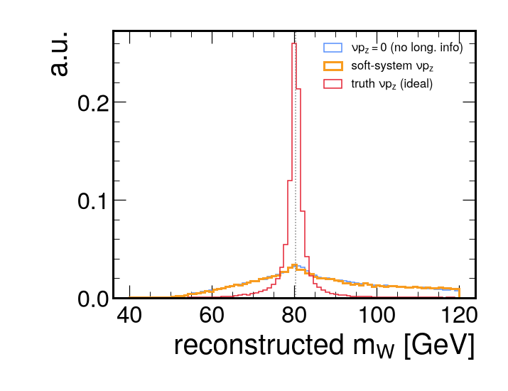

# W-boson boost from the soft system &rarr; W-mass application

Train the soft-particle boost regressor on **Z** (boost known from the dilepton),
apply it to **W&rarr;&mu;&nu;** (boost unknown), then ask what it buys for the W mass.

## 1. Z &rarr; W transfer — the key enabler (it works)
| quantity | corr |
|---|---|
| p_z (Z test, in-domain) | 0.270 |
| **p_z (Z-trained, applied to W)** | **0.283** |
| y_W (Z-trained, applied to W) | 0.290 |

A model trained only on Z predicts the **W** longitudinal boost as well as it does
in-domain on Z. Z genuinely calibrates W — the premise the whole W-mass programme
relies on — and the soft-system boost estimator is portable across the two.

## 2. How strong is the per-event constraint? (honest: weak)
The prior spread of y_W is 1.49; conditioning on the soft system gives a
residual spread of 1.43 — only a **4% reduction**. With
corr&nbsp;&approx;&nbsp;0.29 the soft event explains &approx;8% of the boost
variance, so per event the neutrino p_z is still loosely constrained
(RMS &approx; 266 GeV).

## 3. Reconstructed m_W per event (no improvement yet)
| &nu; p_z hypothesis | median m_W [GeV] | resolution 60&ndash;100 GeV |
|---|---|---|
| truth (ideal check) | 80.30 | sharp |
| soft-system | 80.38 | 9.9 GeV |
| none (p_z = 0) | – | 9.9 GeV |

Directly reconstructing m_W event-by-event from the soft-predicted &nu; p_z does
**not** beat the no-longitudinal-information case at this resolution — the truth-p_z
curve shows the ceiling if the boost were known exactly.

## 4. Where the value actually is
- **Portability (proven):** train on Z, deploy on W — the hard part works.
- **Aggregate, not per-event:** even a weak per-event correlation constrains the
  *ensemble* y_W distribution, which is currently taken from PDFs and is a leading
  m_W systematic. The soft system offers a *data-driven* cross-check on the W
  longitudinal kinematics, orthogonal to the recoil (which only fixes p_T^W).
- **Headroom:** resolution should improve with a heavier model (Transformer on
  GPU), more statistics, and — crucially — by moving beyond Pythia, since the
  MPI-off study shows the signal is in the beam-remnant/ISR fragmentation whose
  data/MC modelling is exactly what a real measurement would pin down.

This is a demonstrator, not a finished measurement: it shows the estimator is
real and portable, and quantifies honestly how much longitudinal information the
soft event currently provides.
